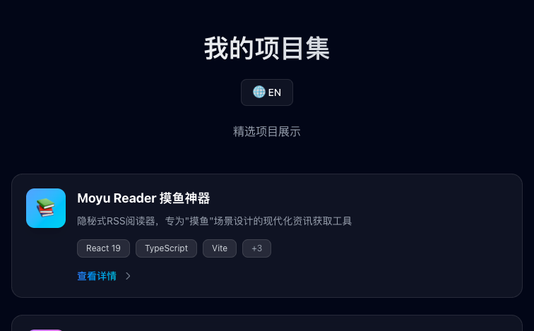

# Portfolio Navigation

A modern personal project portfolio with glassmorphism design, built with React 19, TypeScript, Vite, and Tailwind CSS.



## Features

- 🎨 **Glassmorphism UI** - Frosted glass effects with dynamic gradient backgrounds
- ✨ **Smooth Animations** - Floating, fade-in, and scale animations
- 🌍 **Bilingual Support** - Seamless Chinese/English switching
- 📱 **Responsive Design** - Perfect for desktop and mobile
- ♿ **Accessibility** - ESC key support, focus management, keyboard navigation
- 🚀 **Auto Deployment** - GitHub Actions + Firebase Hosting

## Tech Stack

- **React 19.2.3** - Latest UI framework
- **TypeScript 5.9.3** - Type safety
- **Vite 7.3.1** - Ultra-fast build tool
- **Tailwind CSS 4.1.18** - Utility-first CSS framework

## Getting Started

### Installation

```bash
npm install
```

### Development

```bash
npm run dev
```

Visit http://localhost:5173 to see the application.

### Build

```bash
npm run build
```

### Preview

```bash
npm run preview
```

## Deployment

The project automatically deploys to Firebase Hosting via GitHub Actions when pushing to the `main` branch.

🌐 **Live Demo**: https://portfolio-nav.web.app

## Design Highlights

- Glassmorphism cards with blur effects
- Dynamic gradient backgrounds with animated light orbs
- Subtle grid texture overlay
- Hover interactions with glow effects
- Custom keyframe animations
- Responsive layout for all screen sizes

## Projects

### 📚 Moyu Reader

A stealthy RSS reader designed for discreet news reading at work with an IDE-style interface.

**Tech Stack**: React 19, TypeScript, Vite, Tailwind CSS, Google Gemini AI, Firebase

**Features**: AI translation, gamification system, boss mode, multi-source aggregation

🔗 [Visit Website](https://reader.momoyu.lol)

### 🎮 Pixel Verse Social

A multiplayer pixel art social platform with synchronized YouTube video watching and real-time chat.

**Tech Stack**: React 19, Socket.io, Express, Node.js 22, Google Gemini AI, GCP Cloud Run

**Features**: Video sync, live chat, pixel avatars, virtual space

🔗 [Visit Website](https://pixel-verse.momoyu.lol)

## License

ISC

---

Built with ❤️ using React + TypeScript + Tailwind CSS

